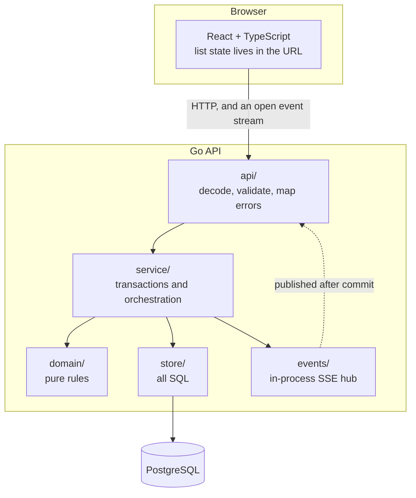
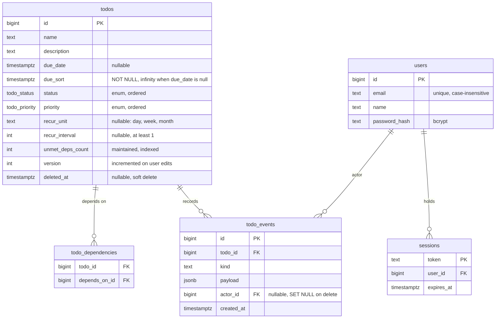
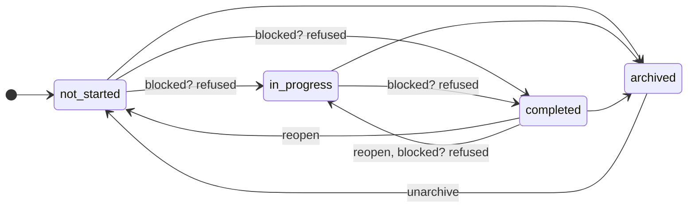
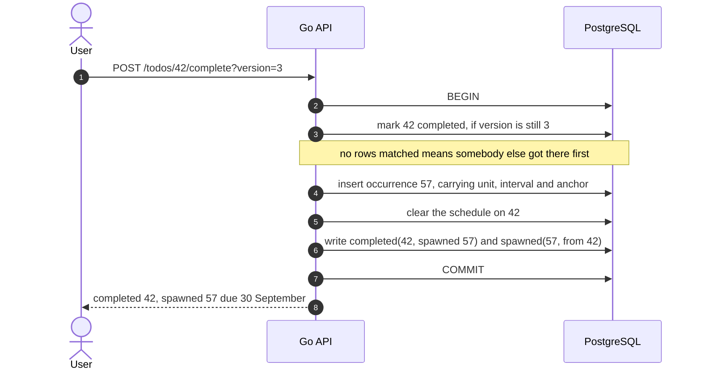
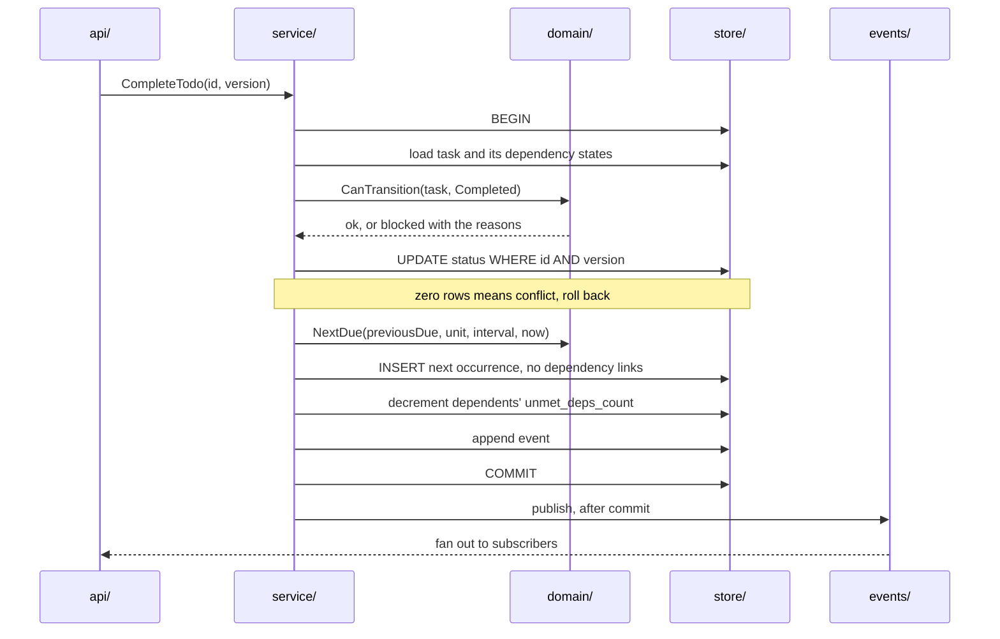

# Architecture

Go API, React front end, PostgreSQL. Four layers on the server, and one rule that keeps them honest: dependencies point one way only.

GitHub renders the diagrams below in place. SF-017 also exports them as images, for viewers that do not.

The diagrams describe what is built.

## Why four layers

`domain/` imports nothing. No database, no HTTP, not even `context`. It holds the two rules that are easy to get wrong: the next-due-date arithmetic and the legal status transitions. Because it takes plain arguments and returns plain values, testing the 31 January case is three lines with no setup and no mock. This is the first place I would look if I were reviewing someone else's version of this project, so it is the first place I made easy to read.

`store/` holds every line of SQL and nothing else. If a query is not in this package, it does not exist.

`service/` holds the rules that need to read before they write. Validation, so they hold for any caller rather than for one handler. The recurrence anchor, which is set once and then carried, and needs to know whether the task was already recurring. And the refusal to reach Completed through an ordinary update, which needs the current status to compare against.

Transactions stay in `store/`. Completing a recurring task is four writes that have to succeed or fail together: mark it done, open the next occurrence, hand the schedule over, adjust every dependent's counter, and record the events. Lifting that into `service/` would mean passing a `pgx.Tx` upward, which puts the database back in the layer above and gains nothing: a transaction is a database concern.

`api/` is thin. It decodes, validates, calls one service method, and maps the result to a status code. Status codes are decided in exactly one file, so there is one place to look when an endpoint returns the wrong one.

I did not add interfaces. `service` takes a concrete `*store.Store`. An interface with one implementation is a claim about future flexibility that the code does not actually have, and it makes every call one indirection harder to follow. If a second implementation ever appears, extracting the interface then is a small change.

## Data model

Five tables, and three of them are obvious. The columns that are not obvious are the ones worth explaining, because each exists to solve a specific problem.

### `due_sort`

Due dates are optional, and that breaks keyset pagination in a way that is easy to miss.

Keyset pagination compares the sort key of the last row you saw against the next page. In SQL that is a row comparison like `(due_date, id) > ($1, $2)`. If `due_date` is NULL, that comparison evaluates to NULL rather than true or false, and `WHERE` drops the row. Tasks with no due date vanish from every page. Not the first page, not the last page. All of them.

Worse, it looks like it works. PostgreSQL's default index order puts nulls last on an ascending scan, so the bug hides until someone sorts descending.

`due_sort` is a plain `NOT NULL` column, set to the due date when there is one and to `infinity` when there is not. The comparison is then total in both directions and needs no special case anywhere.

I tried to make it a generated column so it could never drift from `due_date`. PostgreSQL rejects that: generated expressions must be immutable, and casting text to `timestamptz` is only stable. So it is written by the application alongside `due_date`, in the three places a due date can change.

### `unmet_deps_count`

The brief asks to filter by blocked state at 10,000 items or more. Computing blocked at query time means a subquery, and a subquery cannot share an index with the sort key. Filtering to the handful of blocked tasks while sorting by due date would examine thousands of rows per page.

So each task stores how many of its dependencies are unfinished. Blocked becomes `unmet_deps_count > 0`, which is an ordinary indexed predicate that composes with sorting and with the keyset seek.

It is maintained in exactly four places: a dependency is added, a dependency is removed, a task enters Completed, a task leaves Completed. Archive, delete and restore do not touch it, because only Completed unblocks. That absence is deliberate and it is the one thing in this codebase most likely to look like a missing update, so it carries a comment.

The risk of storing derived state is that it drifts. There is a property test that applies a random sequence of dependency and status changes, then compares every counter against a query that recomputes it from scratch.

### `version`

Optimistic concurrency. Every update matches on the version it read and increments it. Zero rows affected means someone else got there first, and the API returns the current state so the client can show what changed.

One subtlety: counter maintenance does not bump the version. If completing a task bumped the version of everything downstream, anyone with an editor open on a dependent task would get a conflict caused by a change they had nothing to do with, on a field they cannot edit. `version` guards what users edit. `unmet_deps_count` is maintained by the system.

### Status and priority as enums

PostgreSQL enums compare by declaration order, so declaring priority as `low, medium, high` makes `ORDER BY priority DESC` return High, Medium, Low with no expression in the query. That matters because a `CASE` in the `ORDER BY` would stop the index serving the sort, which is the whole point.

The cost is that adding a status later needs a migration. For a fixed set of four, that is a good trade.

## Status transitions

The rules live in `domain/transition.go` and take plain arguments, which is what
makes them three lines to test. Archiving is always allowed, because shelving
something is not progress on it. Everything else has a guard.

Two things this makes visible. Archived only leaves through Not started, so the
interface offers Unarchive rather than a Complete button the server would refuse.
And Completed is guarded as well as In progress: the brief only names In
progress, but a gate you can walk around by skipping a step is not a gate.

## Completing a recurring task

One transaction. The schedule moves to the occurrence that is now open, which is
what stops a series forking when somebody reopens a completed occurrence and
finishes it again.

The version check does double duty. It rejects a stale write, and it makes
completion idempotent: a double click reads one version, so the second attempt
matches no rows and cannot spawn a duplicate.

## Indexes

Every index here exists for a query, and each one is added in the same commit as the query that needs it.

Every one below is partial on `deleted_at IS NULL`, so the ordinary list never walks trash rows, and every one ends in `id` so the keyset seek and the ordering come out of the same index and no sort node is needed.

| Index | Serves |
|---|---|
| `todos_live (created_at DESC, id DESC)` | the default sort and its keyset seek |
| `todos_by_due (due_sort, id)` | sorting by due date, both directions |
| `todos_by_priority`, `todos_by_status`, `todos_by_name` | the other three sort keys |
| `todos_blocked`, `todos_unblocked` on `(created_at DESC, id DESC)` | the blocked and unblocked views on the default sort |
| `todos_recurring (created_at DESC, id DESC)` | the recurring view |
| `todos_name_trgm`, a trigram GIN | substring search, the one query that is not a seek |
| `todo_dependencies (depends_on_id)` | what depends on a task, for the warning before deleting a blocker |
| `todo_events (todo_id, id)` | one task's history in order, the only way it is read |
| `users (lower(email))`, unique | signing in, and case-insensitive uniqueness without citext |
| `sessions (user_id)` | ending every session an account holds |

Blocked gets two partial indexes rather than one composite leading with `unmet_deps_count`. A composite does serve the filter, but blocked is the range predicate `> 0`, and a range on the leading column does not preserve ordering on the columns after it: the planner uses the index and then adds a sort, which is what keyset pagination exists to avoid. Moving the predicate into the index leaves `(created_at, id)` as the whole key, so the ordering comes free and each index holds only the rows it serves.

Nine indexes on `todos` is more than a schema this size usually carries. The brief asks for four sort keys and for the list not to degrade at ten thousand items, and those two requirements together are what buys them. Write volume here is nowhere near the point where maintaining them would cost anything.

[`docs/05-performance.md`](docs/05-performance.md) has the measurements, including the query plans at two hundred thousand rows and the two places these indexes stop helping.

Name filtering is the exception to all of this. Substring matching needs a leading wildcard, which no btree index can serve, so it uses a trigram GIN index and resolves as a bitmap scan followed by a sort rather than a seek. That is a real cost and it is stated rather than hidden. It is paid because prefix matching, which would have kept the seek, is not what anyone means by search. The client requires three characters before it queries, so the shortest and least selective terms never reach the database.

## The transaction worth walking through

Completing a recurring task touches the most machinery, so it is the one to read first.

The event is published after the transaction commits, never inside it. Publishing from inside means a client can receive notice of a change and refetch before that change is visible, and then it sees stale data and stops trusting the stream. This is the other place in the codebase that carries a comment.

## Events

`todo_events` is append-only and written inside the transaction that made the change. It does two jobs: it feeds the live update stream, and it is the audit trail.

It does not drive Trash. Deletion state stays on the row as `deleted_at`, because reconstructing current state by scanning events is slower and much harder to index. Event logs are good at answering what happened. Columns are good at answering what is true now.

## Front end

React with TypeScript, Vite, TanStack Query for server state, and Tailwind v4 for styling. There is no component library.

All list state lives in the URL: filters, sort, cursor, selection. Refreshing reproduces the view, and a link can be pasted mid-demo to land someone on exactly what I am looking at.

The ten primitives in `components/ui/` are hand-built: `Button`, `IconButton`, `Input`, `Select`, `TextArea`, `Field`, `Badge`, `Notice`, `Section` and `ConfirmDialog`. The brief says the interface does not need to be polished, and a library would have been the faster route to a polished one — but it also brings its own design language and a large dependency for a handful of controls, on a screen that needs a table, a form and one dialog. What the interface actually needed was consistency across seven screens, which is a shared vocabulary rather than a package. The colour tokens are held to WCAG AA by a test that reads them out of the stylesheet.

The dependency picker is the one control with real behaviour behind it. It cannot load every other task into a select, because at 200,000 rows that is filtering in the browser, which is precisely what the third requirement forbids. It is a debounced typeahead that queries the API by substring and only ever holds the current matches plus what is already selected.

## Known limits

Live updates are broadcast from memory in one process. Two instances behind a load balancer would not see each other's changes. The fix is Postgres LISTEN/NOTIFY, and I did not build it because the brief asks for something that runs locally.
