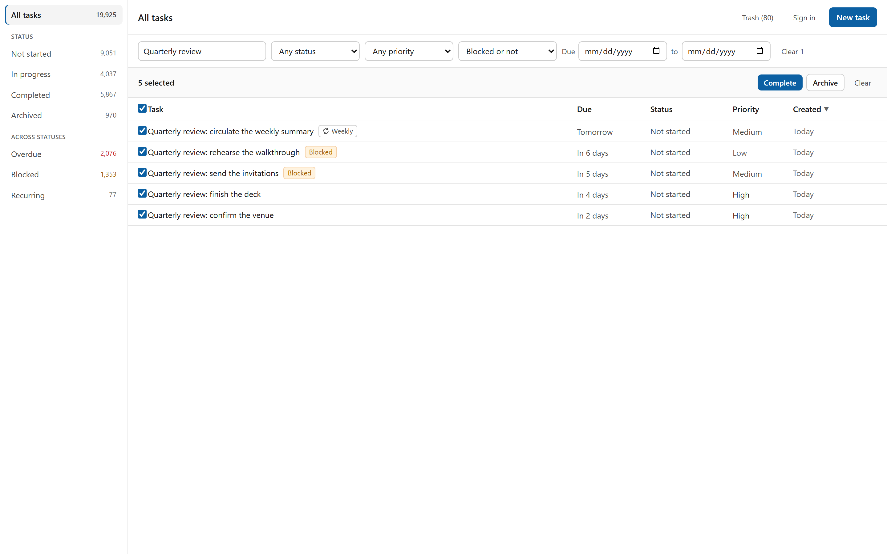
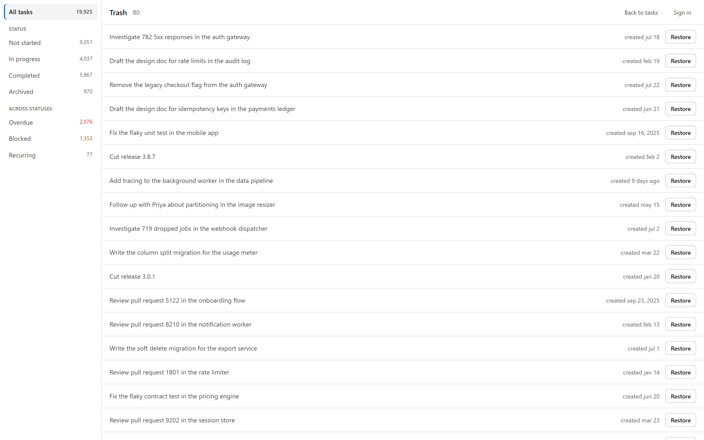
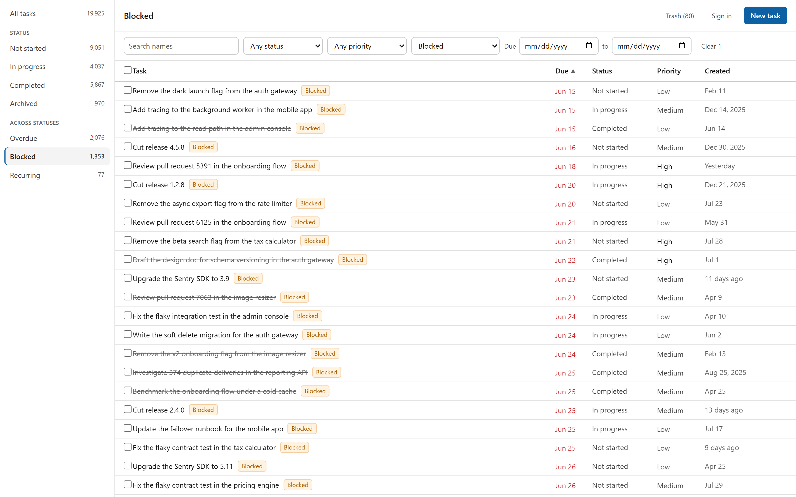

# Interface design

The brief says the interface does not need to be visually polished, and that
functional and usable is sufficient. This document is not an argument against
that. It is the record of a small system built so the interface could stay
*consistent* while it grew from one screen to seven, because the thing that
makes an interface feel unfinished is rarely a lack of polish. It is the same
control looking three slightly different ways on three screens.

That is not a hypothetical. Before this system existed, one working copy of the
front end held three near-identical button styles differing by a hover colour,
two control classes differing by `px-2` against `px-2.5`, and the same
recurrence icon pasted into two files. Nobody chose those differences; they
accumulated one paste at a time.

## Colour

Written in OKLCH, because its lightness axis is perceptually even. Two greys a
step apart look a step apart, which is what makes a three-surface stack
(`canvas`, `raised`, `sunk`) read as depth rather than as three arbitrary
values. In hex the same three would have to be eyeballed.

| Token | Value | Used for |
| --- | --- | --- |
| `canvas` | `oklch(1 0 0)` | The page |
| `raised` | `oklch(0.985 0 0)` | Bars that sit on it: the bulk bar, the trash rows |
| `sunk` | `oklch(0.968 0 0)` | Recessed things: hover, the loading skeleton |
| `ink` | `oklch(0.21 0 0)` | Body text |
| `ink-soft` | `oklch(0.40 0 0)` | Secondary text |
| `ink-faint` | `oklch(0.50 0 0)` | Metadata: created dates, counts |
| `rule` | `oklch(0.916 0 0)` | Hairlines between rows |
| `rule-firm` | `oklch(0.85 0 0)` | Borders that need to be seen: control edges |
| `action` | `oklch(0.48 0.13 250)` | The one accent. Primary buttons, focus rings, the active row |
| `halt` | `oklch(0.55 0.14 65)` | Blocked |
| `late` | `oklch(0.55 0.19 25)` | Overdue, and destructive confirmation |
| `done` | `oklch(0.52 0.11 155)` | Completed |

Three of those carry a `-wash` and an `-edge` variant for the badge and notice
backgrounds that use them.

**Blocked is amber rather than red.** A blocked task is waiting, not broken, and
if it shares a colour with *overdue* then a list of blocked work reads as a list
of problems. Red is reserved for the two things that genuinely are: a missed due
date, and a confirmation you cannot undo.

**One accent, used sparingly.** Everything structural is a neutral. The blue
appears on the primary action, the focus ring, and the selected row, and nowhere
else, so it always means "this is the thing to act on".

### Contrast, and the check that was missing

Every text pair in the interface clears WCAG AA for body text. The tightest is
`halt` on `halt-wash` at 4.57:1; `ink` on `canvas` is 17.72:1.

Those numbers are not written here and trusted. `web/e2e/contrast.spec.ts` reads
the tokens out of `styles.css`, converts OKLCH to sRGB the way a browser does,
and fails if any pair used for text falls below 4.5:1. A second test is a
sentinel: it asserts the palette actually parsed and that a deliberately
unreadable pair is caught, so a green tick cannot mean the regex stopped
matching.

That test was written last, during SF-017, and the reason is worth recording.
Two documents in this project already claimed contrast was measured and had a
sentinel. Neither was true: no such check existed, and the sentence had been
written from an intention rather than from a file. The palette turned out to be
fine, which is luck rather than diligence. The check now exists so the claim is
one somebody can run.

The hairline `rule` at 1.28:1 against the canvas is deliberately below the 3:1
threshold for non-text. It separates rows in a dense table where a visible
border on every row would be louder than the content; nothing depends on seeing
it to understand the list. That is a judgement, and a reviewer may disagree with
it.

## Type

One family, the system sans, at six sizes.

| Size | Where |
| --- | --- |
| 15px | Page and panel titles |
| 14px | The body default |
| 13px | Table rows, controls, buttons |
| 12px | Small buttons, secondary lines, history entries |
| 11px | Section labels, badges |
| 10px | The sort arrow |

The range is deliberately narrow — 10px to 15px — because hierarchy here comes
from weight and colour rather than from size. A task list is scanned in columns,
and a column whose rows differ in height is harder to scan than one that does
not. Numbers that line up in columns get `font-variant-numeric: tabular-nums`
through a `.tabular` utility.

## Components

Ten, plus two icons, in `web/src/components/ui/`. All of them existed before the
screens that use them were finished, which is the point.

| Component | Notes |
| --- | --- |
| `Button` | Six intents, two sizes. Destructive intent shows on hover rather than at rest, so a row of actions does not read as a warning until you reach for the one that is. |
| `IconButton` | A square button for the panel close and similar. |
| `Input`, `Select`, `TextArea` | One shared class vocabulary, so a text field and a dropdown are the same height and share a border. |
| `Field` | The label, the control, and the error message under it. |
| `Badge` | Blocked, and the recurrence cadence. |
| `Notice` | An explanation with a title, used for the blocking reason and for bulk results. |
| `Section` | A labelled block inside the panel. |
| `ConfirmDialog` | Only for delete. |

`Badge` and `Notice` both once spread their props *after* their own
`className`, so any caller passing a class silently replaced the component's
styling instead of adding to it. They merge now. That bug is invisible until
somebody passes a class, which is exactly why extracting the components found it
and reading them would not have.

## Layout

Three columns at `xl` and wider: a views rail, the list, and the detail panel.
Below `xl` the rail becomes a horizontal strip above the list, because at that
width it would be taking space from the thing it navigates.

The list is a table, not cards. The job is scanning a few hundred rows for the
one you want, and a table puts due date, status and priority in fixed columns
where the eye can run down one of them. Cards would put the same information in
a different place in every row.

Two ordering decisions worth stating. Dates read as relative while that is still
useful ("Tomorrow", "In 5 days") and as absolute past a fortnight, so a list
sorted by due date does not read as though every row says the same thing. And
the **Blocked** badge sits before the recurrence badge, because blocked is the
one thing that stops you acting on a row and should register before the name has
finished being read.

## Order this was built in

1. The tokens, before any component.
2. `Button`, `Input`, `Select`, `TextArea`, `Field` — everything that takes input.
3. `Badge`, `Notice`, `Section` — everything that reports state.
4. The table, then the detail panel.
5. `ConfirmDialog`, last, because only one action needed it.

The rail, the filter row and the bulk bar are compositions of the above and
introduced no new primitives, which is the test of whether step 2 was done
properly.

## Screenshots

*The three-column layout. The rail carries live counts, the filter row holds
every filter the brief names, and the table shows the blocked and recurrence
badges inline.*

*The detail panel. The chain under **Waits for** reads downward to the task you
have open, the amber note says what would and would not release it, and the
history records who did what.*

*The bulk bar appears only when there is a selection and sits directly above the
list it acts on, rather than parked in the header where it would be a permanent
control for an occasional job.*

*Deleting is soft, so the trash is a plain list with one action per row. It is a
place you go to undo something, not somewhere you work, which is why it has no
filters, no sorting and no selection — and why the query behind it returns the
hundred most recently deleted rather than everything.*

*The blocked view against twenty thousand seeded tasks. Overdue dates are red
and blocked is amber, so the two never read as the same kind of problem.*

*This screenshot also shows something that looks wrong and is not: several rows
are completed — struck through — and still carry a **Blocked** badge. The count
behind that badge means "how many of my dependencies are unfinished", which stays
true of a completed task whose blocker was later reopened, and has to, because
reopening that task must then be refused. Check 10a of `07-manual-test-plan.md`
walks through it. The honest cost is that this view answers "has unfinished
dependencies" rather than "is stuck".*
